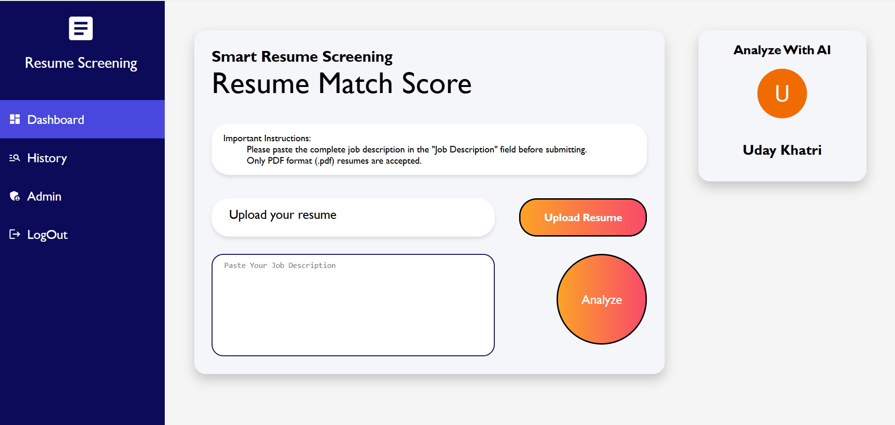
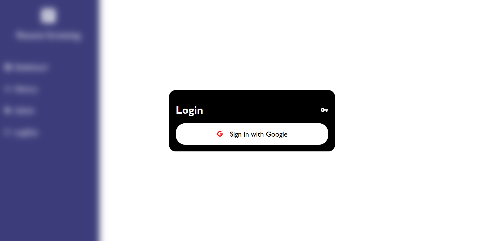
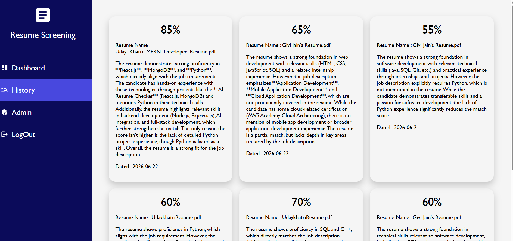
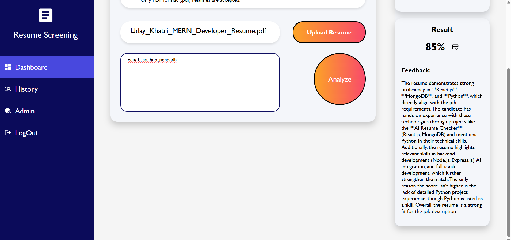
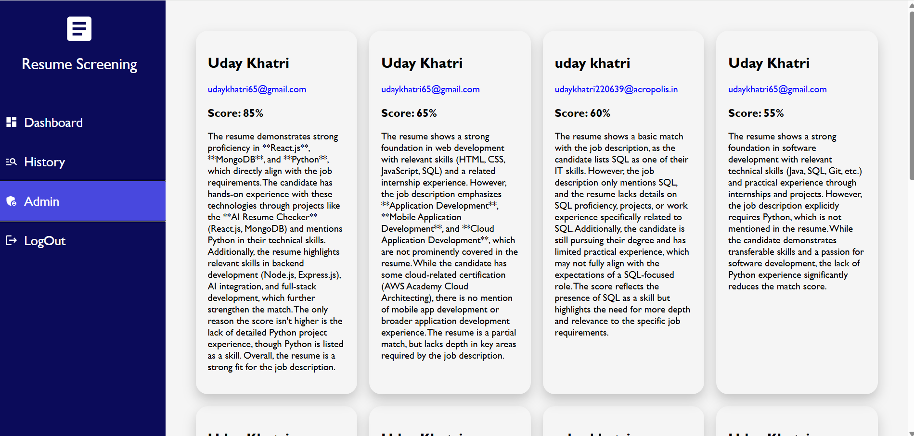

# AI Resume Checker

AI Resume Checker is a full-stack MERN application that helps job seekers evaluate their resumes against job descriptions using AI-powered analysis. The platform provides ATS-style feedback, match scores, skill-gap identification, and actionable improvement suggestions to increase interview chances.

## Features

* Google Authentication using Firebase
* Upload PDF resumes
* Extract text from resumes using PDF parsing
* AI-powered resume analysis with Cohere AI
* Match score generation (0–100%)
* Detailed feedback and improvement suggestions
* Resume history tracking
* Admin dashboard for viewing all submissions
* MongoDB Atlas database integration
  
## Live project Link
https://ai-resume-checker-z14h.onrender.com/

## Screenshots

### Home Page

### Login Page

### Resume Upload

### History

### Admin Dashboard

## Tech Stack

### Frontend

* React.js
* Vite
* CSS Modules
* Material UI
* Axios

### Backend

* Node.js
* Express.js
* MongoDB & Mongoose
* Multer
* PDF-Parse
* Cohere AI

### Authentication

* Firebase Google Login

## Installation

### Clone Repository

git clone https://github.com/yourusername/ai-resume-checker.git

### Install Frontend Dependencies

cd mern_ai
npm install

### Install Backend Dependencies

cd backend_ai
npm install

### Run Frontend

npm run dev

### Run Backend

node index.js

## Application Flow

1. User logs in using Google Authentication.
2. User uploads a PDF resume.
3. Resume text is extracted using PDF-Parse.
4. Cohere AI analyzes the resume against the job description.
5. Match score and detailed feedback are generated.
6. Results are stored in MongoDB and can be viewed later.

## Future Improvements

* Resume Keyword Suggestions
* Resume Improvement Recommendations
* Multiple Resume Comparisons
* Downloadable PDF Reports
* Job Recommendation System

## Author

Uday Khatri

## License

This project is for educational and portfolio purposes.
